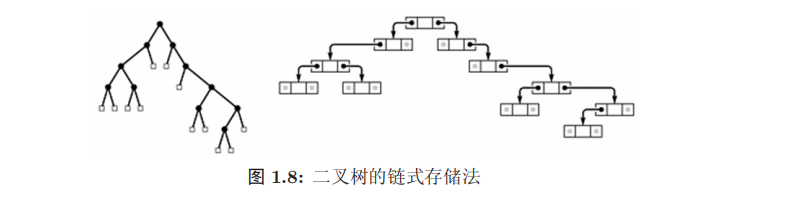

## 数据结构基础

### 逻辑结构：

- 线性表

  特点：有唯一“第一元素”，除最后一个元素，每个元素都有唯一“上一个元素”和“下一个元素”

- 树

  

  

  

  

  

  ​	node;root;leaf;ancestor(最顶层);father->parent;son->child;subtree;brother;depth;height;

- 图

  

  树实际上可以看成图的特殊表示，图包括节点以及其相互关系

  G = （V，E）；G->图；V->结点；E->边；

  有向图；加权图

### 逻辑结构的实现

1. 线性结构
  - 数组

    绝对定位，物理位置连续

    缺点：删除元素需要整个数组进行大改

  - 链表

    相对定位，物理位置不连续

    缺点：随机访问慢，需要遍历到相应位置

2. 树

   - 树是保证连通的最小单位，树对应唯一堆栈操作序列。

   - 二叉树：**每个结点最多有两个子树**

     - 链式存储

       

     - 数组存储(满二叉树)

   ​				多数情况下，数组表示树不是很有效率

   ​				**从根开始，每层自左向右编号为1，2，3**，除了结点1外，每个结点i的父亲是i/2,左儿子是2i，右儿子是2i+1。

   - 一般意义的树：(左儿子右兄弟表示)

     - 转化为二叉树存储；**left child-right sibling representation**

       

3. 图：

   - adjacency matrix->邻接矩阵

     邻接矩阵：记录任何两个结点之间是否有边

     缺点明显：占用空间大

     稠密图或结点数较少时经常用邻接矩阵表示，算法简单

   - adjacency list ->邻接表

     为每个结点做了链表

     稀疏图经常用邻接表来表示

### 抽象数据类型**(ADT)**

- 优先队列(priority queue)

  通常，优先队列的实现都通过堆操作

  ->堆：特别的树状数据结构；

  若是满足以下特性，即可称为堆：“给定堆中任意节点P和C，若P是C的母节点，那么P的值会小于等于（或大于等于）C的值”。若母节点的值恒**小于等于**子节点的值，此堆称为**最小堆**（min heap）；反之，若母节点的值恒**大于等于**子节点的值，此堆称为**最大堆**（max heap）。在堆中最顶端的那一个节点，称作**根节点**（root node），根节点本身没有**母节点**（parent node）。

- 队列(queue)

  FIFO

- 栈(STACK)

  FILO

### 复杂度

- 多项式时间算法/指数时间算法

- NP完全问题（未发现多项式算法的问题）

- ### 计算模型

  - 决策树(decision tree)

    每个决策树都表述了一种树型结构，它由它的分支来对该类型的对象依靠属性进行分类

    相对于其他数据挖掘算法，决策树在以下几个方面拥有优势：

    - **决策树易于理解和实现.**人们在通过解释后都有能力去理解决策树所表达的意义。
    - **对于决策树，数据的准备往往是简单或者是不必要的.**其他的技术往往要求先把数据一般化，比如去掉多余的或者空白的属性。
    - **能够同时处理数据型和常规型属性。**其他的技术往往要求数据属性的单一。
    - **是一个白盒模型。**如果给定一个观察的模型，那么根据所产生的决策树很容易推出相应的逻辑表达式。
    - **易于通过静态测试来对模型进行评测。**表示有可能测量该模型的可信度。
    - **在相对短的时间内能够对大型数据源做出可行且效果良好的结果。**

    **计算模型的选择非常重要！**